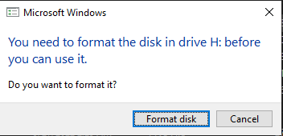
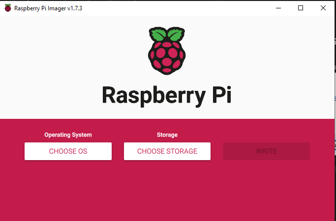
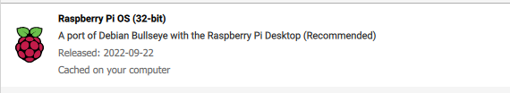
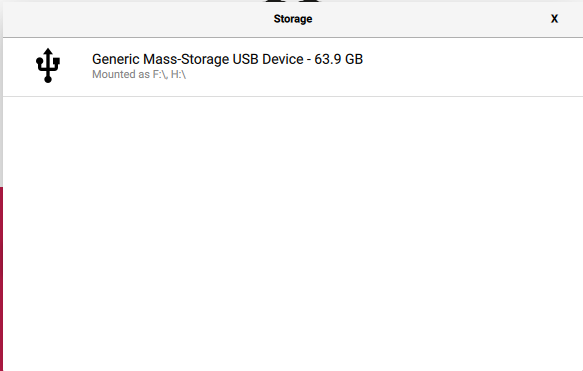
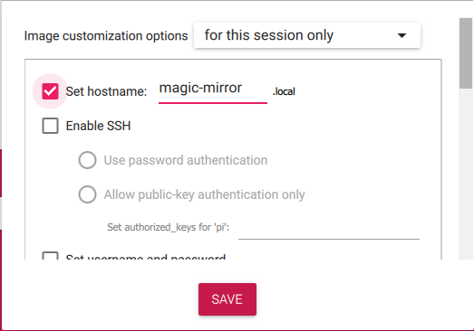
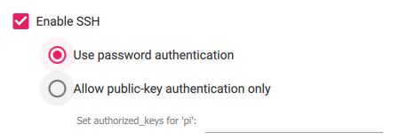
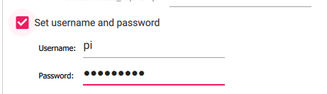
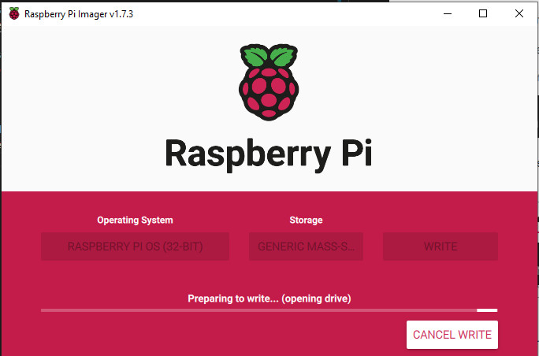

# How to Install Raspbian on Raspberry Pi
# Step 1: Download the raspberry pi Imager

For Windows: [Download](https://downloads.raspberrypi.org/imager/imager_latest.exe)

For macOS: [Download](https://downloads.raspberrypi.org/imager/imager_latest.dmg)

For Ubuntu x86: [Download](https://downloads.raspberrypi.org/imager/imager_latest_amd64.deb)

# Step 2: Download the Raspbian OS to raspberry pi
**NOTE:** if you got this notification when plugging in your SD card, click on the "cancel" option.



Open the Raspberry Pi Imager



Choose the OS to install (make sure you choose the 32-bit version)



Choose the SD card to install the OS



# Step 3: Install the OS to the SD card
Before you install the OS, set the hostname (the name can be anything you want)



Enable SSH



Set the username and password



Set Locale time settings


## and click save

# Step 4: Write the SD card
**NOTE:** It will erase the whole data on the SD Card.



# Installing Magic Mirror
## Install Node.js
```bash
curl -sL https://deb.nodesource.com/setup_16.x | sudo -E bash -
sudo apt-get install -y nodejs
```

## Install MagicMirror (Will be changed after modified)
### NOTES: Run inside the raspberry pi desktop not <u>ssh</u>
```bash
git clone git@github.com:Smart-Mirror-Project/smart-mirror.git
cd code/magic-mirror
npm run install-mm
cp config/config.js.sample config/config.js
npm run start
npm run server
```